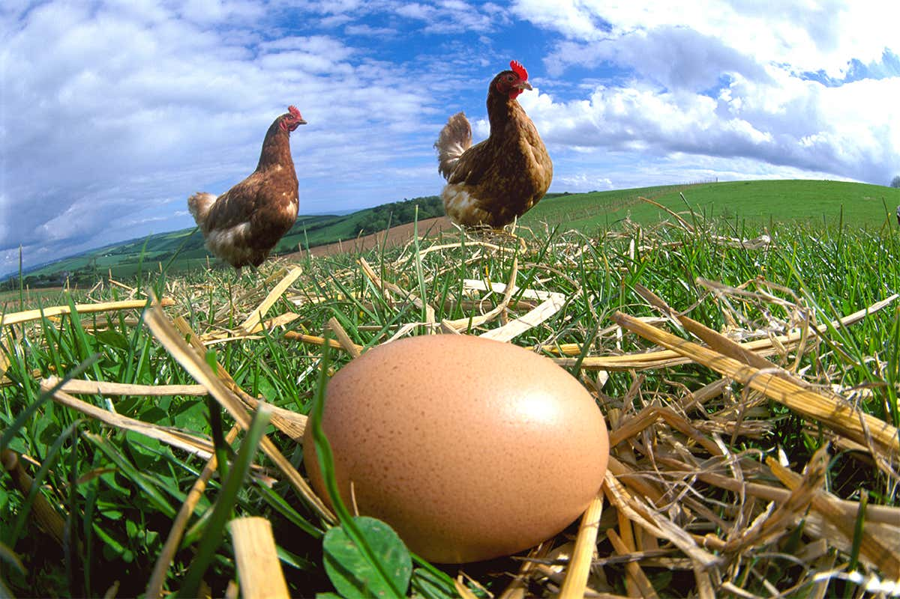

import Tabs from '@theme/Tabs';
import TabItem from '@theme/TabItem';

You've heard the age-old riddle: "Which came first: the chicken or the egg?" Taken metaphorically, it's a meditation on the futility of determining the cause of a self-perpetuating cycle. Taken literally, it's a great question for evolutionary biologists.

Chickens come from eggs, but eggs come from chickens. So which came first?

<!--truncate-->

:::tip
Which came first, *the chicken* or *the egg*?

<Tabs>
  <TabItem value="js" label="JS">
  ```js
  const question = ['🥚','🐔'];
  const answer = question.sort();
  console.log(answer[0] + ' was first!');
  ```
  </TabItem>
  <TabItem value="react" label="React">
  ```jsx
  <button onClick={
    () => {
      const question = ['🥚','🐔'];
      const answer = question.sort();
      return alert(answer[0] + ' was first!');
    } 
  }>Click me!</button>
  ```
  </TabItem>
</Tabs>

<button onClick={
  () => {
    const question = ['🥚','🐔'];
    const answer = question.sort();
    return alert(answer[0] + ' was first!');
  } 
}>Click me!</button>

:::

<!-- https://images.newscientist.com/wp-content/uploads/2021/05/21153947/what-came-first-the-chicken-or-the-egg-gettyimages-a0048-000156_chickenegg_web.jpg -->

