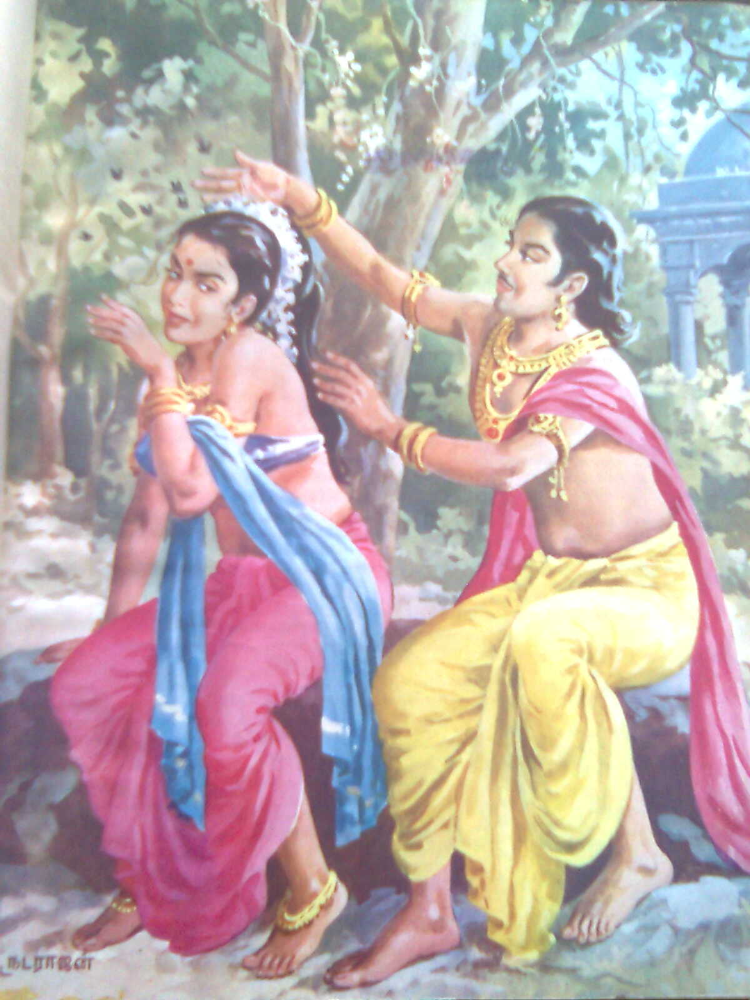

import Highlight from '@site/src/components/Highlight';

### <Highlight color='#800031' highlight='fg' fontWeight='bold'> கொங்கு தேர் வாழ்க்கை </Highlight>

<Highlight color='#004080' highlight='fg' fontWeight='bold'> 2. குறிஞ்சி </Highlight> <Highlight color='#004080' highlight='fg'> - தலைவன் கூற்று </Highlight>

<Highlight color='#006666' highlight='fg' textAlign='center'>
  கொங்கு தேர் வாழ்க்கை அஞ்சிறைத் தும்பி!   
  காமம் செப்பாது, கண்டது மொழிமோ:   
  பயிலியது கெழீஇய நட்பின், மயில் இயல்,   
  செறி எயிற்று, அரிவை கூந்தலின்   
  நறியவும் உளவோ, நீ அறியும் பூவே?   
</Highlight>

<Highlight color='#531A02' highlight='fg'>
  இயற்கைப் புணர்ச்சி புணர்ந்தவழி, தலைமகளை இயற்கைப் புணர்ச்சிக்கண் இடையீடுபட்டு நின்ற 
  தலைமகன், நாணின் நீக்குதற்பொருட்டு, மெய் தொட்டுப் பயிறல் முதலாயின அவள்மாட்டு நிகழ்த்திக
</Highlight>

<Highlight color='#351C75' highlight='format' textAlign='right'> குறுந்தொகை - 02 </Highlight>
<Highlight color='#351C75' highlight='format' textAlign='right'> பாடியவர் - இறையனார் </Highlight>

<!--truncate-->

  
<Highlight color='#25c2a0'>கருத்து:</Highlight> இயற்கைப் புணர்ச்சிக்குப் (தலைவியைத் தலைவன் இயல்பாகப் பார்த்துக் காதல் கொள்ளுதல்) பின்னர் தலைவியைச் சந்திக்கும் தலைவன் அவளின் நாணத்தை நீக்குதல் பொருட்டு, மெய்தொட்டுப் பயின்று (தலைவியின் உடல் தொட்டு உரையாடல்) நலம் பாராட்டுதல் ( தலைவியின் அழகு நலத்தைப் பாடுதல்)

தலைவி நாணத்தோடு இருப்பதை உணர்ந்த தலைவன் அவளின் நாணத்தை நீக்க தும்பியைப் பார்த்துப் பேசுகிறான்.
பூக்களில் உள்ள மணத்தை ஆராய்ந்து தேனை உண்ணுகின்ற வாழ்கையினையும், அகத்தே சிறகுகளையும் கொண்ட வண்டே!

எனக்கு இன்பம் தருவதற்காகப் பொய் கூறாமல், நீ உண்மையென அறிந்த ஒன்றை என் கேள்விக்கு விடையாகத் தருவாயாக,

பழகுதற்கு இனிய, மயிலைப் போன்ற சாயலையும், செறிந்த பற்களையும் உடைய இவ்வரிவையின் கூந்தலைப் போன்ற மணம் நீ அறிந்த மலர்களுக்கு உண்டா..?

### சொற்களஞ்சியம்

**கொங்கு** - பூவின் மகரந்தம்   
**தேர்** - தேர்நெடுக்கும்   
**வாழ்க்கை** - வாழும்   
**அஞ்சிறைத்தும்பி** - உள்ளே சிறகுகளை உடைய தும்பி(வண்டு) - (**அம் சிறை** - அழகிய சிறகுகள்)   
**காமம் செப்பாது** - நான் விரும்பியதைச் சொல்லாது   
**கண்டது மொழிமோ** - நீ கண்டறிந்ததைக் கூறு   
**பயலியது கெழீய நட்பின்** - பல பிறவிகளிலும் நட்புடன் விளங்கும்(கெழி-நட்பு)   
**மயிலியல்** - மயில் போன்ற   
**செறியியெற் றரிவை** - செறிவான பற்களைக்(எயிறு) கொண்ட பெண்   
**கூந்தலின்** - கூந்தலை விட   
**நறியவும் உளவோ** - மணமிகுந்த ஏதேனும் உள்ளதோ   
**நீ அறியும் பூவே** - நீ அறிந்த பூக்களிடம்   

திருவிளையாடற் புராணத்திலும்(<Highlight color='#25c2a0' highlight='fg'>தருமிக்குப் பொற்கிழி அளித்த படலம்</Highlight>) இந்தப் பாடல் மேற்கோள் காட்டப்படுகிறது. செண்பகப் பாண்டியனுக்கு ஏற்பட்ட ஐயத்தைப் போக்க இறைவன் தருமி மூலம் கொடுத்தனுப்பிய பாடல்.

(நக்கீரருக்கும் இறைவனுக்கும் இடையான உரையாடலின் சிறுபகுதி  கீழ்வருமாறு)

பாண்டியன் அவையில் ‘கொங்குதேர் வாழ்க்கை’ என்னும் செய்யுளின் பொருள் குறித்துச் சங்கப் புலவராக வந்த சிவபெருமானுக்கும், நக்கீரர்க்கும் ஒரு வாதம் நிகழ்ந்தது. அப்போது சிவபெருமான் கூறியதாக வரும் வெண்பா:

<Highlight color='#006666' highlight='fg' textAlign='center'>
  அங்கங் குலுங்க அரிவாளில் நெய்தடவிப்   
  பங்கம் படஇரண்டு கால்பரப்பிச் - சங்கைக்   
  கீர்கீர் என அறுக்கும் கீரனோ என்கவியை   
  ஆராய்ந்து சொல்ல தக்கவன்   
</Highlight>

இதற்கு நக்கீரர் பின்வரும் செய்யுளால் விடையிறுத்தார்.

<Highlight color='#006666' highlight='fg' textAlign='center'>
  சங்கறுப்ப தெங்கள்குலம் சங்கரனார்க்கு ஏதுகுலம்   
  பங்கமுறச் சொன்னால் பழுதாமோ - சங்கை   
  அரிந்துண்டு வாழ்வோம் அரனாரைப் போல   
  இரந்துண்டு வாழ்வ திலை   
</Highlight>

<iframe width="100%" height="315" 
  src="https://www.youtube.com/embed/_Bd_9aan9_4?si=g5tuA1gR55lVBvIV&amp;start=281" 
  title="YouTube video player" frameborder="0" 
  allow="accelerometer; autoplay; clipboard-write; encrypted-media; gyroscope; picture-in-picture; web-share" 
  allowfullscreen
  >
</iframe>

### மேற்கோள்கள்

1. [குறுந்தொகை - கொங்குதேர் வாழ்க்கை](https://rampsychiatrist.blogspot.com/2011/03/blog-post_10.html)
2. [தமிழ் இணையக் கல்விக்கழகம் - கொங்குதேர் வாழ்க்கை](https://www.tamilvu.org/ta/library-l1220-html-l12206g5-122848)
3. [திருவிளையாடற் புராணம் 52](https://ta.wikisource.org/wiki/%E0%AE%A4%E0%AE%BF%E0%AE%B0%E0%AF%81%E0%AE%B5%E0%AE%BF%E0%AE%B3%E0%AF%88%E0%AE%AF%E0%AE%BE%E0%AE%9F%E0%AE%B1%E0%AF%8D_%E0%AE%AA%E0%AF%81%E0%AE%B0%E0%AE%BE%E0%AE%A3%E0%AE%AE%E0%AF%8D/52)
4. [தருமிக்குத் தண்ணருள் --திருவிளையாடல் --- மலரும் தமிழ்](https://eluthu.com/kavithai/287376.html)
5. [பெண்களின் கூந்தல் மணம் இயற்கையானதா? - UPSC EXAM TAMIL](https://www.gunathamizh.com/2010/01/blog-post_24.html)
6. [நக்கீரர் பரதர்](https://bharathar.blogspot.com/2006/)
7. [பேராசிரியர் நினைவுகள்: நயமெனப் படுவது யாதெனின் - ஹரி கிருஷ்ணன்](http://www.tamilonline.com/thendral/article.aspx?aid=6481)
8. [திருக்குறள் : 508](https://www.valaitamil.com/theraan-piranaith-thelindhaan-vazhimurai-theeraa-itumpai-tharum-kural-508.html)

## வெகுமதி - Bonus
### திருக்குறள் : 508  - அரசியல்

<Highlight color='#006666' highlight='fg' textAlign='left'>
  தேரான் பிறனைத் தெளிந்தான் வழிமுறை  
  தீரா இடும்பை தரும்.
</Highlight>

### கலைஞர் உரை

ஆராய்ந்து   பார்க்காமல்    ஒருவரைத்  துணையாகத் தேர்வு செய்து,
அமர்த்திக்கொண்டால் அவரால் வருங்காலத் தலைமுறையினர்க்கும் நீங்காத
துன்பம் விளையும்.

### Translation

Who trusts an untried stranger, brings disgrace, 
Remediless, on all his race.